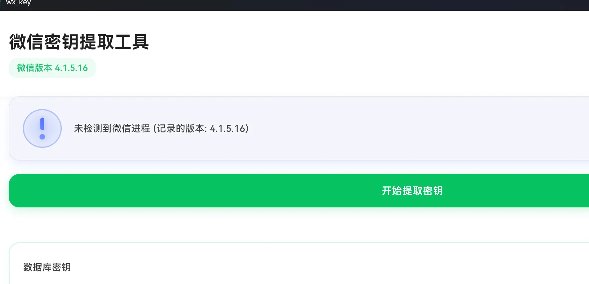
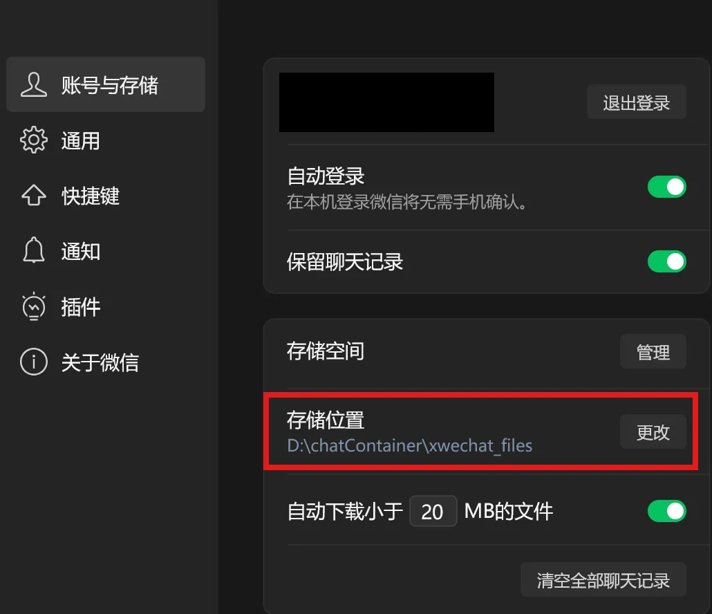
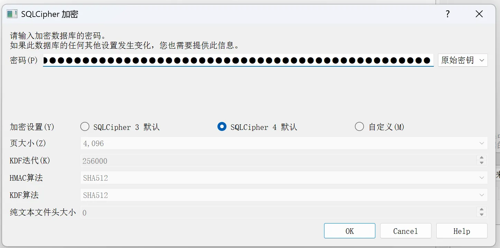
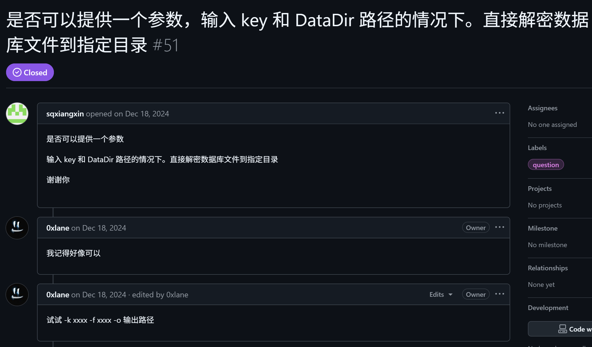

# 文献本地数据库解密与导出操作指南

## ⚠️ 风险提示 (Disclaimer)
**本操作涉及对文献客户端进程的内存注入及数据读取，属于非官方授权行为。无论使用何种工具进行DLL注入，均存在被文献安全机制检测并导致账号被冻结或永久封禁（封号）的风险。请务必评估风险后操作，建议使用小号测试。**

---

## 一、 前置准备
1.  **环境要求**：Windows 操作系统。
2.  **所需工具**：
    *   密钥获取工具：`DbkeyHookUI`（推荐，相对安全）或 `app_key.exe`。
    *   数据库处理工具：`wechat-dump-rs.exe`。
    *   数据库查看工具：`DB Browser for SQLite`。

---

## 二、 操作步骤

### 第一步：同步聊天记录
1.  登录 PC 端文献。
2.  在手机端文献选择“迁移与备份”功能，将目标聊天记录迁移至电脑端。
3.  确保迁移完成后，聊天记录已完整保存在电脑本地。


### 第二步：获取全局密钥 (Global Key)
1.  保持 PC 端文献处于登录状态。
2.  运行密钥获取工具（`DbkeyHookUI` 或 `app_key.exe` 选其一）。
3.  按照工具提示进行操作，通过 DLL 注入方式读取文献进程内存。
4.  **记录输出结果**：成功后，您将获得一串 64 位或 32 位的密钥（以下称为**全局密钥**）。


### 第三步：定位并备份目标数据库
1.  **定位文件**：打开文件资源管理器，进入文献数据存储目录。路径通常为：
    `[安装盘符]\xwechat_files\wxid_*******\`
    *注：`wxid_*******` 为您的个人文献 ID 文件夹。*
2.  **查找数据库**：在子文件夹中找到路径：
    `\db_storage\message\message_0.db`
    *注：`message_0.db` 存储了核心聊天记录。*
3.  **建立备份**：**请务必将 `message_0.db` 复制一份到其他安全目录进行后续操作**，切勿直接对原文件进行修改，以免数据损坏。


### 第四步：计算数据库专用密钥
由于文献采用分库加密机制，需利用全局密钥计算出 `message_0.db` 的特定密钥。

1.  打开命令提示符（CMD）或 PowerShell，定位到 `wechat-dump-rs.exe` 所在目录。
2.  执行以下命令：
    ```bash
    ./wechat-dump-rs.exe -k [全局密钥] -f [message_0.db的备份路径] -r --vv 4
    ```
    *   `-k`：填入第二步获取的全局密钥。
    *   `-f`：填入第三步备份的数据库文件路径。
3.  **获取结果**：执行成功后，终端将输出一个以 `0x` 开头的字符串，此即为该数据库的**专用密钥**。


### 第五步：查看数据库内容
1.  打开 `DB Browser for SQLite` 软件。
2.  点击“打开数据库”，选择备份的 `message_0.db` 文件。
3.  在弹出的加密设置窗口中进行如下配置：
    *   **Password/Key（密码/密钥）**：填写第四步获取的以 `0x` 开头的**专用密钥**。
    *   **Encryption Settings（加密设置）**：将加密方式（Passphrase type）设置为 **Raw key**（如果软件支持）或直接输入密钥，并在 Page Size 或 Encryption Setting 中选择 **SQLCipher 4 defaults**。
4.  点击确认，若配置正确，即可成功浏览数据库内的聊天记录表。


---

## 三、 进阶操作：永久解密导出 (可选)

若需要将数据库转换为未加密的标准 SQLite 文件以便后续分析，可执行以下命令：

1.  在命令行工具中执行：
    ```bash
    .\wechat-dump-rs.exe -k [全局密钥] -f [未解密源文件路径] -o [解密后输出路径]
    ```
    *   `-k`：填入全局密钥。
    *   `-f`：源数据库文件路径。
    *   `-o`：指定导出的新文件名（例如 `decrypted_msg.db`）。

2.  执行完成后，生成的 `.db` 文件即为标准 SQLite 格式，可直接使用任何 SQLite 工具打开，无需再次输入密码。


---

## 四、 参考
https://github.com/0xlane/wechat-dump-rs  
https://github.com/gzygood/DbkeyHook  
https://github.com/ycccccccy/wx_key